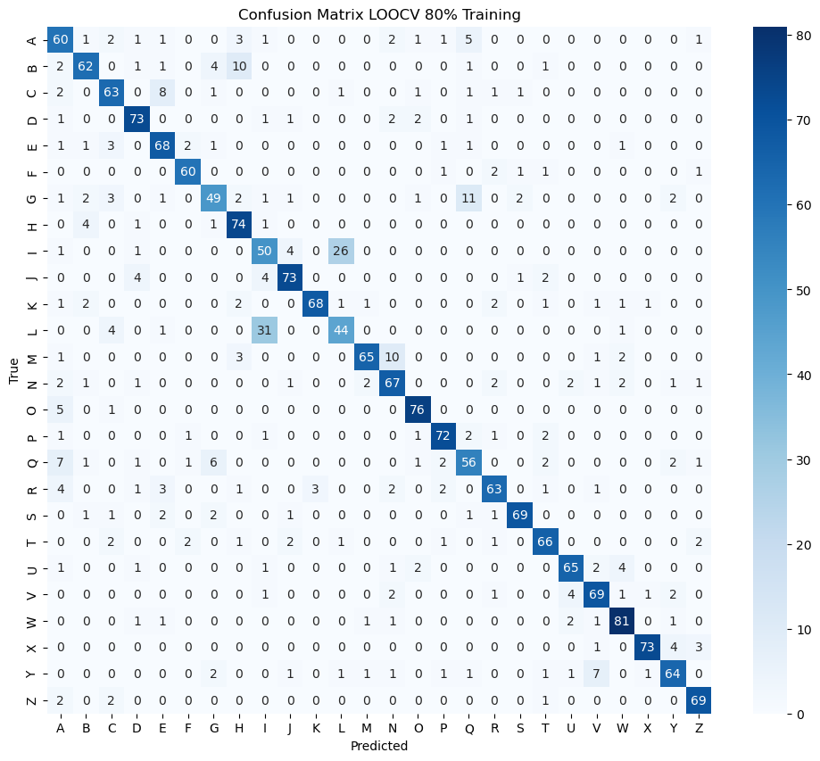

# 🧠 Character Classification using HOG and Support Vector Machine (SVM)

This repository contains the source code for a character classification project developed as part of the **Computer Vision (RE604)** coursework.

The project uses **HOG (Histogram of Oriented Gradients)** for feature extraction and a **Support Vector Machine (SVM)** classifier to recognize handwritten alphabet characters from the EMNIST Letters dataset.

---

## 📌 Project Description

This project is implemented in Python using the following libraries:

- `scikit-learn` – for model training, evaluation, and cross-validation  
- `scikit-image` – for HOG feature extraction  
- `matplotlib` – for visualization  
- `numpy`, `scipy` – for numerical operations

The dataset used is the **EMNIST Letters** dataset, available on Kaggle:  
👉 [EMNIST Dataset on Kaggle](https://www.kaggle.com/datasets/crawford/emnist)

> The EMNIST Letters dataset contains grayscale images of handwritten English letters labeled from **'a' to 'z'**.

---

## ⚙️ Methodology

1. **Data Loading & Preprocessing**
   - Load the EMNIST `.mat` file using `scipy.io`.
   - Normalize pixel values and reshape images to 28×28.

2. **Feature Extraction**
   - Extract gradient features using **HOG**.
   - Visualize the resulting HOG image for sample data.

3. **Model Training**
   - Use **SVM** from `scikit-learn` for classification.
   - Tune hyperparameters using **GridSearchCV**.
   - Evaluate using **Leave-One-Out Cross-Validation (LOOCV)**.

4. **Evaluation**
   - Measure accuracy, precision, recall, and F1-score.
   - Display predictions and plot the confusion matrix.

---

## 🧪 Evaluation Results

Model evaluation results are presented below:

- **LOOCV Accuracy**: 81.68% 
- **Precision**: 82.04% 
- **Recall**: 81.68%  
- **F1 Score**: 81.72%

> These results show the model's capability to classify handwritten characters with decent performance.


---

## 👤 Biodata

**Nama**: Daipansyah Arya Saputra  
**Universitas**: Politeknik Negeri Batam  
**Program Studi**: Robotika  
**Kelas**: RE 6A Pagi  

---

## 🎥 Link Video
👉 [Link]()


## 🛠️ Installation

To install the required dependencies, run:

```bash
pip install scikit-learn scikit-image matplotlib numpy scipy
